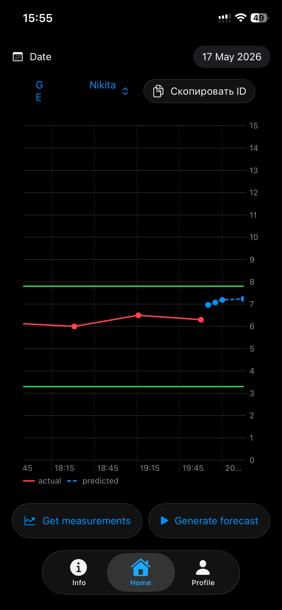
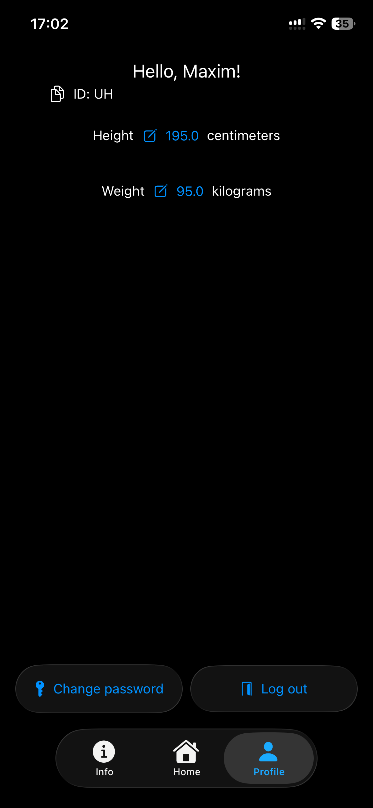

# HealthCare

## Архитектура
Проект разработан на SwiftUI с использованием архитектуры MVVM-R. 

## Цель проекта
Разработать приложение для отслеживания здоровья пациентов.
Функционал доступный для врачей и пациентов включает в себя:
- Отслеживание уровня глюкозы в графическом виде
- Просмотр предсказания уровня глюкозы на ближайшие 30 минут с помощью MLP модели
- Просмотр данных пациента и возможность поиска контакта для связи между врачами и пациентами

## Дальнейшее развитие
В дальнейшем планируется добавление возможности отслеживания других параметров здоровья. Переработка интерфейса будет проведена для улучшения пользовательского опыта.

## Как это выглядит
<!--

  
  
  

-->

<table>
<tr>
  <td align="center">Главный экран</td>
  <td align="center">Экран с информацией о пациенте/враче</td>
  <td align="center">Личный экран пользователя</td>
</tr>
  <tr>
    <td></td>
    <td></td>
    <td></td>
    
  </tr>
</table>
